# Modbus Poll (version 9.10.0 and earlier) mbp file has a buffer overflow vulnerability
#### Exploit Title: Modbus Poll (version 9.10.0 and earlier) mbp file has a buffer overflow vulnerability
#### Exploit Author: webraybtl@webray.com.cn inc
#### Vendor Homepage: https://www.modbustools.com
#### Software Link: https://www.modbustools.com/download/ModbusPollSetup32Bit.exe
#### Software Link:  https://www.modbustools.com/download/ModbusPollSetup64Bit.exe
#### Version: V9.10.0 build 1777 and earlier
#### Tested on: Win7_x86 SP1
## Description
When mbpoll.exe opens a file of type mbp, it does not check the length of the content, causing the length of the content to exceed the default buffer size of the program. It can overwrite the structured exception handler (SEH) address in the stack and execute arbitrary code.

## Proof of Concept
POC file: https://github.com/Durian1546/vul/blob/main/webray.com.cn/Modbus%20Poll/poc/poc.mbp

First install ModbusPollSetup32Bit.exe. After the default installation, the path of the main program mbpoll.exe is “C:\Program Files\Modbus Tools\Modbus Poll\mbpoll.exe”.

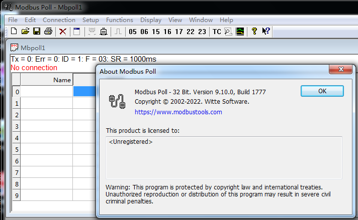

Then use the Windbg debugger to open the mbpoll.exe program, and then enter the "g" command to run the program.

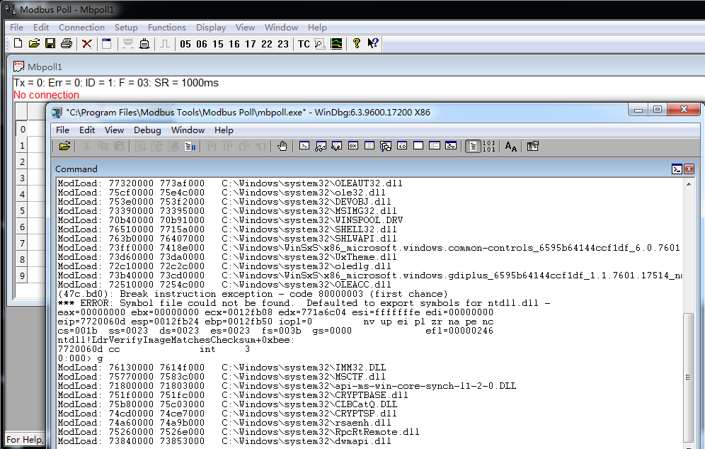

Finally, click the Open option in the File menu of the Modbus Poll menu bar to open the poc.mbp file and trigger the vulnerability. At this time, the EIP value in Windbg is 0xe4b6f8f5.

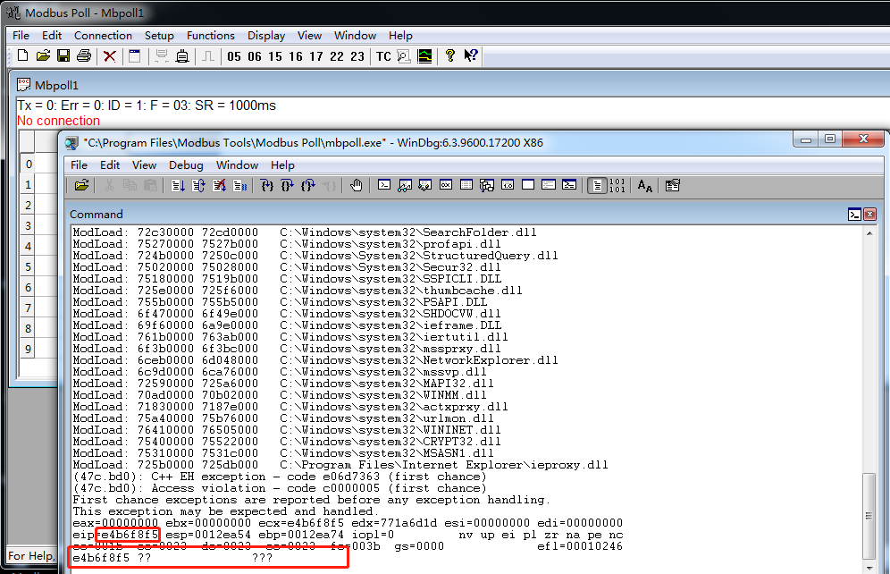

## Analysis
Use Winhex to open poc.mbp, the content of the first 4 bytes is A00F0000, indicating the version number of the mbp file.When Modbus Poll opens the mbp file, it will check whether the version number is correct.

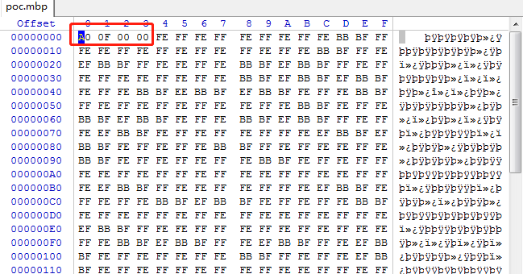

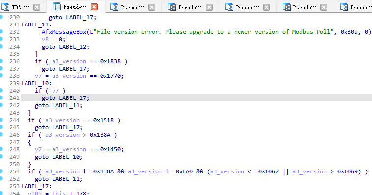

After the version check is correct, the function called at the address 0x00402661 is the AfxReadStringLength function, which reads one byte of data from the poc.mbp file at offset 0x48, and the content at this time is 0xEF.

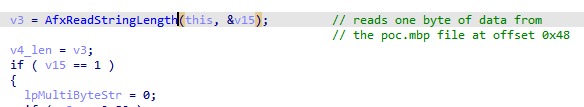

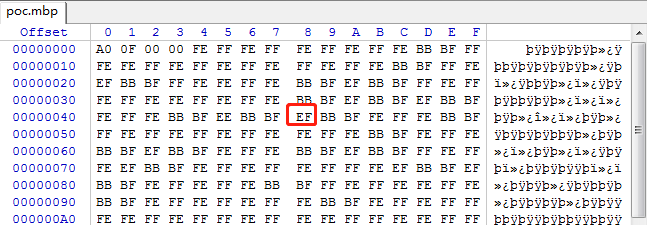

Then use the content of one byte just read as the length of the subsequent read data, and call the CArchive::Read function to read the specified length backward from the poc.mbp offset of 0x49. At this time, the data content with the size of 0xEF will be read.

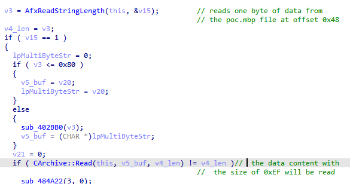

Then convert the read content to UNICODE encoding.

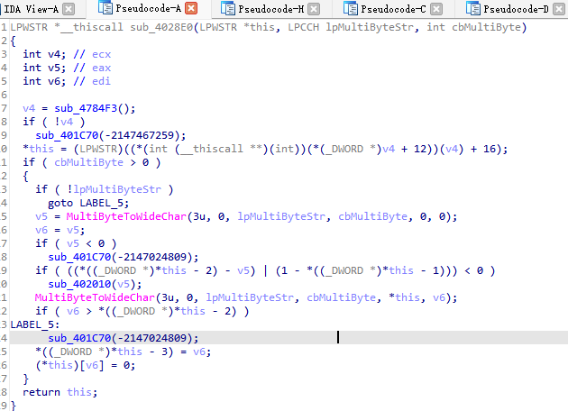

Finally, call the lstrcpyW function at address 0x0044AA6E to copy the UNICODE-encoded data to another variable nNumber[7] in the stack.

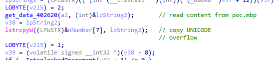

At this time, the size of the nNumber[7] buffer is 64 bytes, which is smaller than the buffer lpString2 after the data read from the file is converted to UNICODE, and overflow will occur, causing the data content read from poc.mbp to overwrite The Structured Exception Handler (SEH) address in the stack. When the subsequent code runs abnormally, it will jump to the overwritten exception handling address 0xe4b6f8f5 to execute arbitrary code.

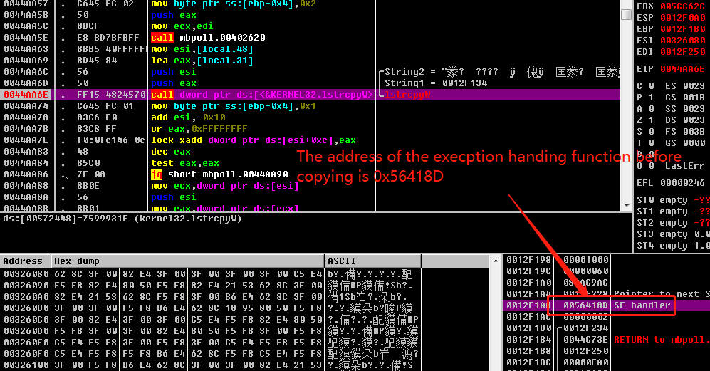

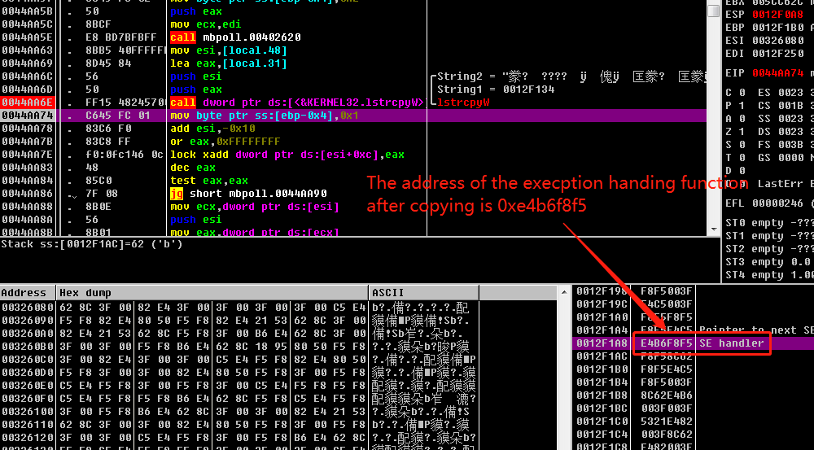
