# Modbus Slave (version 7.5.1 and earlier) mbs file has a buffer overflow vulnerability
#### Exploit Title: Modbus Slave (version 7.5.1 and earlier) mbs file has a buffer overflow vulnerability
#### Exploit Author: webraybtl@webray.com.cn inc
#### Vendor Homepage: https://www.modbustools.com
#### Software Link: https://www.modbustools.com/download/ModbusSlaveSetup32Bit.exe
#### Software Link:  https://www.modbustools.com/download/ModbusSlaveSetup64Bit.exe
#### Version: V7.5.1 build 1742 and earlier
#### Tested on: Win7_x86 SP1
## Description
When mbslave.exe opens a file of type mbs, it does not check the length of the content, causing the length of the content to exceed the default buffer size of the program. It can overwrite the structured exception handler (SEH) address in the stack and execute arbitrary code.

## Proof of Concept
First install ModbusSlaveSetup32Bit.exe. After the default installation, the path of the main program mbslave.exe is “C:\Program Files\Modbus Tools\Modbus Slave\mbslave.exe”.

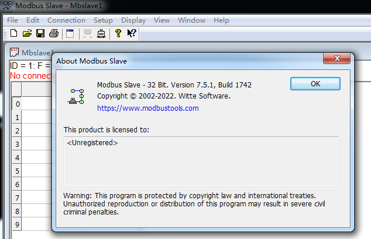

Then use the Windbg debugger to open the mbslave.exe program, and then enter the "g" command to run the program.

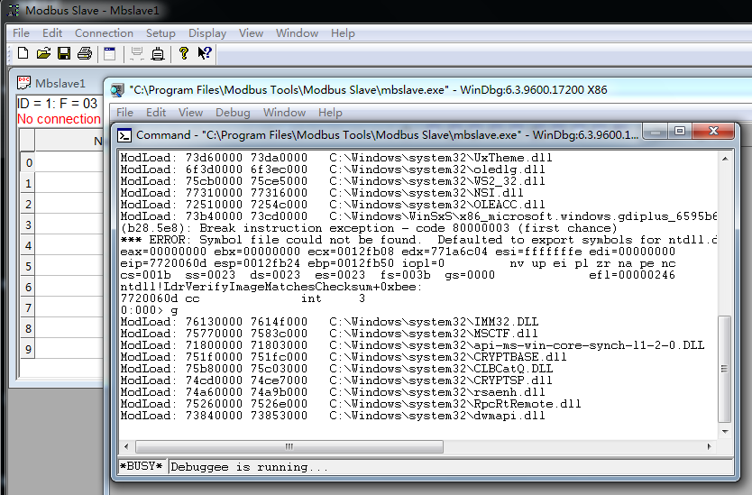

Finally, click the Open option in the File menu of the Modbus Slave menu bar to open the poc.mbs file and trigger the vulnerability. At this time, the EIP value in Windbg is 0xe4c5f8f5.

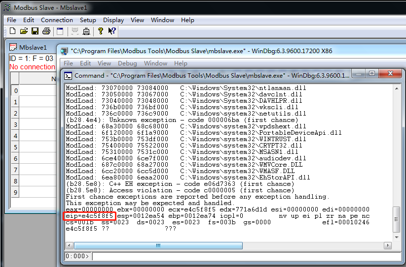

## Analysis
Use Winhex to open poc.mbs, the content of the first 4 bytes is A00F0000, indicating the version number of the mbs file.When Modbus Slave opens the mbs file, it will check whether the version number is correct.

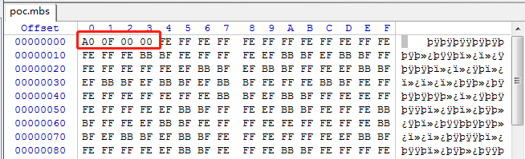

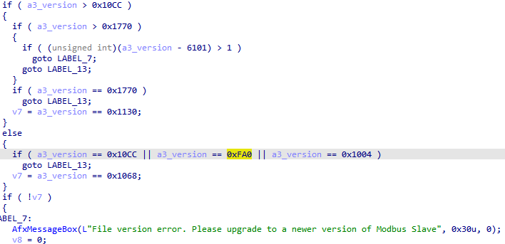

After the version check is correct, the function called at the address 0x00402BA1 is the AfxReadStringLength function, which reads one byte of data from the poc.mbs file at offset 0x40, and the content at this time is 0xFE.

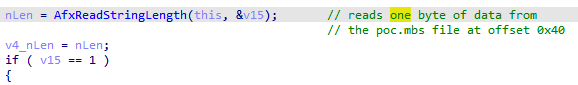

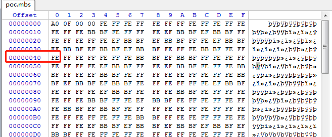

Then use the content of one byte just read as the length of the subsequent read data, and call the CArchive::Read function to read the specified length backward from the poc.mbs offset of 0x41. At this time, the data content with the size of 0xFE will be read.

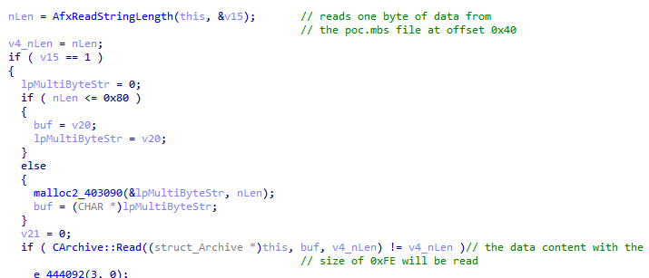

Then convert the read content to UNICODE encoding.

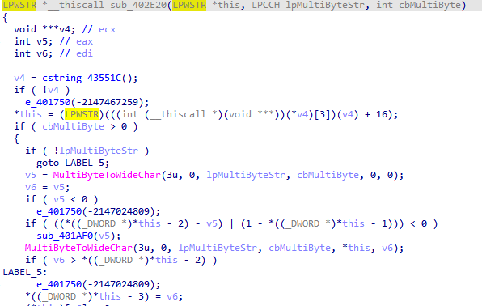

Finally, call the lstrcpyW function at address 0x0041F655 to copy the UNICODE-encoded data to another variable String1 in the stack.

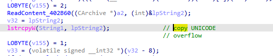

At this time, the size of the String1 buffer is 64 bytes, which is smaller than the buffer lpString2 after the data read from the file is converted to UNICODE, and overflow will occur, causing the data content read from poc.mbs to overwrite The Structured Exception Handler (SEH) address in the stack. When the subsequent code runs abnormally, it will jump to the overwritten exception handling address 0xe4c5f8f5 to execute arbitrary code.

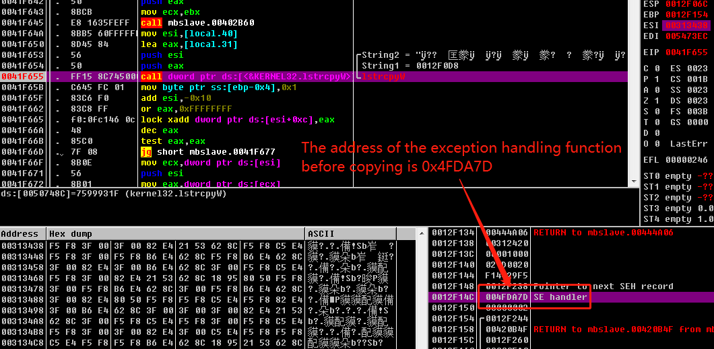

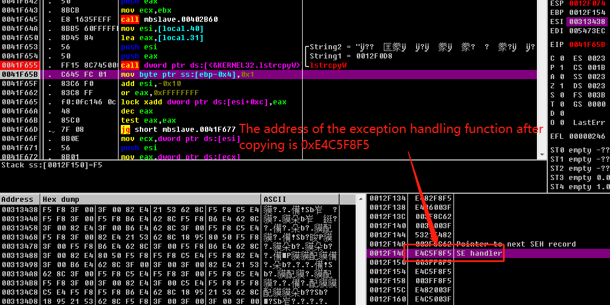

